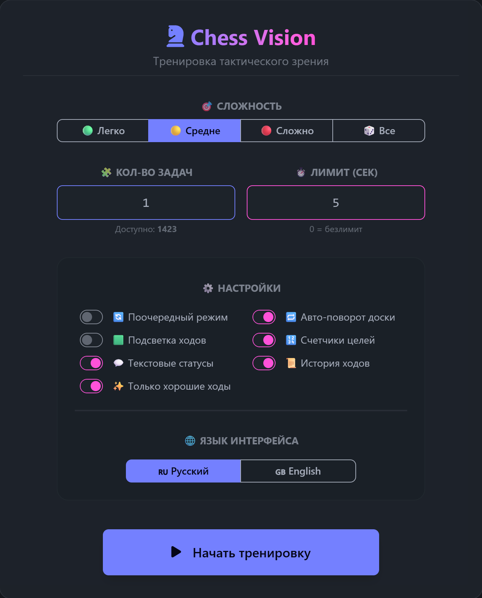

# ♟️ Chess Vision Trainer

Интерактивный тренажер шахматного зрения (Chess Vision). Помогает развивать навык мгновенного нахождения тактических ударов, шахов и взятий на доске.


*(Добавьте скриншот интерфейса сюда)*

## 🚀 Возможности

*   **Поиск целей**: Тренировка нахождения всех шахов и взятий в позиции.
*   **Два режима**:
    *   *Обычный*: Найти все возможные шахи и взятия.
    *   *Только хорошие*: Найти только те ходы, которые не ведут к немедленной потере фигуры (зевкам).
*   **Мгновенная обратная связь**:
    *   Визуальные подсказки (стрелки).
    *   Анимация опровержения "плохих" ходов с объяснением ошибки.
*   **Умный таймер**: "Честный" учет времени — таймер ставится на паузу пока показывается анимация ошибки.
*   **Статистика**:
    *   Точность (% правильных нахождений).
    *   Среднее время на задачу.
    *   Подробный лог ходов (с иконками фигур).
*   **Настройки**:
    *   Сложность (Easy, Medium, Hard).
    *   Таймер (на задачу или общий).
    *   Авто-поворот доски.

## 🛠 Технологии

Проект полностью мигрирован на **Modern Stack**:

*   **Core**: [TypeScript](https://www.typescriptlang.org/) (Строгая типизация, ООП архитектура).
*   **UI Framework**: [DaisyUI](https://daisyui.com/) + [TailwindCSS](https://tailwindcss.com/) (Современный, адаптивный дизайн, темы).
*   **Chess Logic**: 
    *   [Chess.js](https://github.com/jhlywa/chess.js) (Логика ходов, валидация).
    *   [Chessground](https://github.com/lichess-org/chessground) (Рендеринг интерактивной доски от Lichess).
*   **Build**: Typescript Compiler (`tsc`).

## 📂 Структура проекта

*   `src/` — Исходный код на TypeScript.
    *   `core/` — Логика игры (GameSession, PuzzleManager).
    *   `ui/` — Управление интерфейсом (UIManager, BoardRenderer).
    *   `utils/` — Утилиты (анализ позиции, локализация).
    *   `types/` — Type definitions.
*   `dist/` — Скомпилированный JavaScript (используется в production).
*   `generate_puzzles_strict.py` — Скрипт генерации задач (Python).

## 🚀 Установка и запуск

1.  **Клонировать репозиторий**:
    ```bash
    git clone https://github.com/your-username/chess-vision-trainer.git
    cd chess-vision-trainer
    ```

2.  **Установить зависимости**:
    ```bash
    npm install
    ```

3.  **Сборка проекта (TypeScript -> JavaScript)**:
    ```bash
    npm run build
    ```
    *Для авто-сборки при изменениях:* `npm run dev`

4.  **Запуск (Локальный сервер)**:
    ```bash
    npm run serve
    ```
    *Или просто откройте `index.html` через Live Server.*

## 📈 Генерация задач

В проекте есть Python скрипт для генерации новых задач из PGN файлов:

```bash
python generate_puzzles_strict.py
```
Скрипт анализирует позиции и создает `puzzles.json` с классификацией (шахи, взятия, хорошие/плохие ходы).

## 🌐 Deployment (GitHub Pages)

Проект готов к деплою на GitHub Pages:
1. Загрузите код в репозиторий (включая папку `dist`).
2. В настройках репозитория -> **Pages**:
   - Source: `Deploy from a branch`
   - Branch: `main` / `master` (folder `/root`)
3. Сайт будет доступен по адресу `https://username.github.io/chess-vision-trainer/`.

---

**License**: MIT